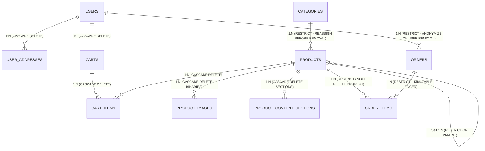

# DronesZ Backend: DBMS Architecture & Comprehensive Deletion Strategy Guide

---

## 1. Executive Architectural Overview

The DronesZ backend utilizes a relational database management system (**PostgreSQL**) orchestrated through Spring Data JPA and Hibernate. A production e-commerce platform handles multiple fundamentally different classes of data:

1. **Financial & Legal Records** (Invoices, Orders, Tax lines)
2. **Master Catalog Records** (Products, Variations, Categories, Bundles)
3. **Identity & Regulatory Records** (Customers, Addresses, Credentials)
4. **Ephemeral Session Records** (Shopping Carts, Temporary Reservations)
5. **Binary & Content Blobs** (Images, Specifications, Documentation Tables)

A common junior engineering mistake is treating every table with the same deletion rule: either putting `ON DELETE CASCADE` everywhere or plastering `is_deleted = true` across every entity. Both extremes cause catastrophic business failures.

---

## 2. The 5 Data Deletion Paradigms

Before assigning strategies to entities, we must define the 5 deletion paradigms in modern DBMS engineering:

```
┌──────────────────────────────────────────────────────────────────────────────────┐
│                               5 DELETION PARADIGMS                              │
├──────────────────┬───────────────────┬───────────────────────────────────────────┤
│ Paradigm         │ Mechanism         │ Typical Target Entities                   │
├──────────────────┼───────────────────┼───────────────────────────────────────────┤
│ 1. Hard Delete   │ SQL `DELETE FROM` │ Carts, Cart Items, Temporary Tokens       │
│ 2. Soft Delete   │ `is_deleted=true` │ Products, Categories                      │
│ 3. State Machine │ `status='REFUND'` │ Orders, Payments, Shipments               │
│ 4. Anonymization │ Scrub PII         │ Users (GDPR / Right to be Forgotten)      │
│ 5. Orphan Evict  │ JPA Cascade Purge │ Product Content Sections, Orphaned Images │
└──────────────────┴───────────────────┴───────────────────────────────────────────┘
```

### Paradigm 1: Hard Delete (Physical Removal)
* **SQL**: `DELETE FROM cart_items WHERE id = 10;`
* **What happens**: The physical rows and their index tuples are marked as dead in PostgreSQL heap pages, eventually reclaimed by the `VACUUM` process.
* **When to use**: Data has **zero** historical, accounting, or audit value once the operation is completed.

### Paradigm 2: Soft Delete (Logical Archival)
* **SQL**: `UPDATE products SET is_deleted = TRUE, deleted_at = NOW() WHERE id = 5;`
* **What happens**: The row remains in the table, preserving foreign keys. Standard queries append `WHERE is_deleted = FALSE` to hide archived rows from the storefront.
* **When to use**: Entities that are referenced by historical transactions (e.g. past orders referencing a drone that is no longer sold).

### Paradigm 3: Finite State Machine (Lifecycle Transitions)
* **SQL**: `UPDATE orders SET status = 'CANCELLED', updated_at = NOW() WHERE id = 42;`
* **What happens**: The entity is **never deleted**. It transitions to a terminal lifecycle state.
* **When to use**: **Orders, Invoices, Payments, Refunds**. Deleting a financial transaction is accounting fraud and breaks fiscal audits.

### Paradigm 4: PII Scrubbing & Anonymization (Regulatory Deletion)
* **SQL**:
  ```sql
  UPDATE users 
  SET full_name = 'Anonymized User',
      email = CONCAT('deleted_', id, '@anonymized.dronesz.com'),
      phone = NULL,
      password_hash = 'DISABLED',
      enabled = FALSE
  WHERE id = 15;
  ```
* **What happens**: Personal data is purged to satisfy privacy regulations (GDPR / Indian DPDP Act), while keeping the surrogate key (`id`) intact so past sales orders remain linked to a valid database row.

### Paradigm 5: Foreign Key Cascade Strategies
* `ON DELETE CASCADE`: Deleting the parent automatically purges children.
* `ON DELETE RESTRICT` / `NO ACTION`: Aborts deletion if any child record references this parent.
* `ON DELETE SET NULL`: Preserves children but blanks out the parent reference.

---

## 3. Entity-by-Entity Deletion & Architecture Matrix

| Entity Table | Primary Key | Foreign Keys | Deletion Strategy | On Parent Delete Rule | Business Justification |
| :--- | :--- | :--- | :--- | :--- | :--- |
| **`orders`** | `id` (BIGINT) | `user_id` -> `users(id)` | **NEVER DELETE (FSM)** | `ON DELETE RESTRICT` | Legal tax invoice & financial audit record. Must be preserved for 7+ years. |
| **`order_items`** | `id` (BIGINT) | `order_id` -> `orders(id)`, `product_id` -> `products(id)` | **NEVER DELETE** | `ON DELETE RESTRICT` (from order) | Immutable snapshot of purchased item, price, tax rate, and quantity. |
| **`products`** | `id` (BIGINT) | `category_id`, `parent_id` | **SOFT DELETE** (`ARCHIVED`) | `ON DELETE RESTRICT` (from category) | Past orders reference this product. Hard deleting breaks warranty lookups. |
| **`categories`** | `id` (BIGINT) | None | **SOFT DELETE** (`is_active=false`) | N/A | Prevents breaking product catalog navigation when reorganizing store. |
| **`users`** | `id` (BIGINT) | None | **ANONYMIZATION / DEACTIVATE** | N/A | Preserves user ID for order history while removing privacy data. |
| **`user_addresses`**| `id` (BIGINT) | `user_id` -> `users(id)` | **HARD DELETE** | `ON DELETE CASCADE` (from user) | Order table stores static text snapshot (`delivery_address`). User can freely purge addresses. |
| **`carts`** | `id` (BIGINT) | `user_id` -> `users(id)` | **HARD DELETE** | `ON DELETE CASCADE` (from user) | Ephemeral shopping session. No retention requirement once checked out or abandoned. |
| **`cart_items`** | `id` (BIGINT) | `cart_id`, `product_id` | **HARD DELETE** | `ON DELETE CASCADE` (from cart & product) | Transient shopping items. Deleting a product removes it from active carts. |
| **`product_images`**| `id` (BIGINT) | `product_id` -> `products(id)` | **HARD DELETE** | `ON DELETE CASCADE` (from product) | Heavy `BYTEA` binaries. Removing from product should free disk storage. |
| **`product_content_sections`** | `id` | `product_id` -> `products(id)` | **HARD DELETE** | `ON DELETE CASCADE` (from product) | Child text/specs owned exclusively by the product. |
| **`admins`** | `id` (BIGINT) | None | **SOFT DEACTIVATE** (`enabled=false`) | N/A | Admin accounts must be deactivated, never deleted, to preserve audit logs. |

---

## 4. Architectural Deep Dive: What Happens When a Parent Entity is Deleted?

Let us explicitly answer the core mentor question:

> **"What should happen if the parent entity is deleted, updated, or deactivated?"**

### Scenario A: A Customer (`User`) requests Account Deletion

#### Current Flaw in DronesZ (Migration V5):
```sql
CREATE TABLE orders (
    ...
    user_id BIGINT NOT NULL REFERENCES users(id) ON DELETE CASCADE
);
```
* **The Catastrophe**: If an admin deletes a customer from the database, PostgreSQL triggers `CASCADE`, which **deletes every single order and invoice ever placed by that customer**!
* **The Financial Impact**: Total revenue reports will plummet. GST/Tax reports will no longer reconcile with the bank statement. If the customer claims a chargeback with their credit card company, the merchant has zero evidence.

#### The Correct DBMS Architecture:
1. Alter `orders.user_id` foreign key from `ON DELETE CASCADE` to **`ON DELETE RESTRICT`**.
2. If an API requests `DELETE /api/user/{id}`, the database **blocks** the deletion if past orders exist.
3. The application implements an **Anonymize & Deactivate Workflow**:
   ```sql
   -- 1. Invalidate active session and drop temporary cart
   DELETE FROM carts WHERE user_id = :targetUserId;
   
   -- 2. Drop saved addresses
   DELETE FROM user_addresses WHERE user_id = :targetUserId;
   
   -- 3. Scrub personally identifiable information (PII)
   UPDATE users 
   SET full_name = 'Deactivated User',
       email = CONCAT('anonymized_', id, '@dronestore.internal'),
       phone = NULL,
       password_hash = 'ACCOUNT_PERMANENTLY_DISABLED',
       enabled = FALSE,
       updated_at = NOW()
   WHERE id = :targetUserId;
   ```
4. **Outcome**: The customer cannot log in, personal data is scrubbed to satisfy privacy laws, but the **historical orders remain 100% intact**.

---

### Scenario B: An Admin deletes a `Product` that was sold previously

#### Current Flaw in DronesZ:
```sql
CREATE TABLE order_items (
    ...
    product_id BIGINT REFERENCES products(id) ON DELETE SET NULL
);
```
* **What happens now**: If an admin hard-deletes a product, PostgreSQL sets `order_items.product_id = NULL`.
* **The Business Impact**: 
  - The customer's order history still displays the string `product_name: "X-500 Carbon Drone"`.
  - But clicking the item yields an error (`404 Not Found`).
  - The customer cannot download firmware, lookup replacement propellers, or verify warranty dates.
  - Furthermore, if this product was a parent kit with child products, PostgreSQL throws an error because of `parent_id REFERENCES products(id) ON DELETE RESTRICT`.

#### The Correct DBMS Architecture:
1. Products **must never be physically deleted** once placed in the catalog.
2. Introduce an `ARCHIVED` status or soft-delete column:
   ```sql
   ALTER TABLE products ADD COLUMN is_deleted BOOLEAN NOT NULL DEFAULT FALSE;
   ALTER TABLE products ADD COLUMN deleted_at TIMESTAMP WITHOUT TIME ZONE;
   ```
3. When the admin clicks "Delete Product":
   ```sql
   UPDATE products 
   SET is_deleted = TRUE, 
       deleted_at = NOW(), 
       status = 'OUT_OF_STOCK' 
   WHERE id = :productId;
   ```
4. **Outcome**:
   - Storefront queries filter out archived items: `SELECT * FROM products WHERE is_deleted = FALSE`.
   - Order history and warranty lookups continue to resolve `order_items.product_id` without broken references.

---

### Scenario C: A `Category` is deleted

#### Current State in DronesZ (Migration V3):
```sql
CREATE TABLE products (
    ...
    category_id BIGINT REFERENCES categories(id) ON DELETE RESTRICT
);
```
* **What happens**: PostgreSQL enforces `ON DELETE RESTRICT`. If an admin tries to delete `"FPV Racing Drones"`, and 25 drones belong to it, PostgreSQL rejects the query:
  `ERROR: update or delete on table "categories" violates foreign key constraint "products_category_id_fkey" on table "products"`
* **Is this correct?**: **YES.** `RESTRICT` prevents accidental destruction of the product catalog.
* **Business Solution**:
  Before a category can be deleted, the admin must either:
  1. Reassign the products to another category (e.g. `"Uncategorized"`).
  2. Soft-delete the category by setting `is_active = false`, hiding it from the top navbar while products remain mapped.

---

### Scenario D: A Customer clears or checks out their `Cart`

#### Current State in DronesZ:
```sql
CREATE TABLE cart_items (
    ...
    cart_id BIGINT NOT NULL REFERENCES carts(id) ON DELETE CASCADE,
    product_id BIGINT NOT NULL REFERENCES products(id) ON DELETE CASCADE
);
```
* **Is this correct?**: **YES.**
* When a customer empties their cart or completes checkout, executing `DELETE FROM cart_items WHERE cart_id = ?` is the textbook correct approach.
* If a product is permanently removed from the store, cascading the delete to `cart_items` cleans up customers' carts automatically so they don't try to purchase a non-existent item.

---

## 5. Complete Relational ER Diagram with Deletion Policies



---

## 6. Implementation Blueprint: JPA & Flyway Migration

### Step 1: Flyway SQL Migration (`V9__enforce_strict_deletion_and_soft_deletes.sql`)

```sql
-- 1. Fix Dangerous Order Deletion Cascade: Prevent orders from vanishing when a user is purged
ALTER TABLE orders DROP CONSTRAINT IF EXISTS orders_user_id_fkey;
ALTER TABLE orders 
    ADD CONSTRAINT fk_orders_user_id 
    FOREIGN KEY (user_id) REFERENCES users(id) ON DELETE RESTRICT;

-- 2. Add Soft Delete fields to Products
ALTER TABLE products 
    ADD COLUMN IF NOT EXISTS is_deleted BOOLEAN NOT NULL DEFAULT FALSE,
    ADD COLUMN IF NOT EXISTS deleted_at TIMESTAMP WITHOUT TIME ZONE;

CREATE INDEX IF NOT EXISTS idx_products_is_deleted ON products(is_deleted);

-- 3. Add Soft Delete fields to Categories
ALTER TABLE categories 
    ADD COLUMN IF NOT EXISTS is_active BOOLEAN NOT NULL DEFAULT TRUE;

-- 4. Add Deletion Timestamp to Users for compliance auditing
ALTER TABLE users 
    ADD COLUMN IF NOT EXISTS deleted_at TIMESTAMP WITHOUT TIME ZONE;
```

---

### Step 2: Spring Data JPA Entity Annotations for Soft Delete

In your `Product.java` entity, integrate Hibernate's native `@SQLDelete` and `@Where` annotations:

```java
@Entity
@Table(name = "products")
@SQLDelete(sql = "UPDATE products SET is_deleted = true, deleted_at = CURRENT_TIMESTAMP WHERE id = ?")
@Where(clause = "is_deleted = false")
public class Product {

    @Id
    @GeneratedValue(strategy = GenerationType.IDENTITY)
    private Long id;

    @Column(name = "is_deleted", nullable = false)
    private Boolean isDeleted = false;

    @Column(name = "deleted_at")
    private LocalDateTime deletedAt;

    // Standard business fields...
}
```

* **How this works**:
  - When `productRepository.delete(product)` is invoked anywhere in your backend, Hibernate intercepts it and executes an `UPDATE products SET is_deleted = true...` instead of a physical `DELETE`.
  - When calling `productRepository.findAll()`, Hibernate automatically appends `AND is_deleted = false` to the generated SQL query!
  - If an admin or order lookup explicitly needs historical products, a native or unrestricted repository method can query all rows including soft-deleted ones.

---

## 7. Summary Principles for DronesZ Backend

1. **Financial Ledger Rule**: Orders and Order Items are write-once, read-many. Never delete. Transition through statuses (`PAID`, `SHIPPED`, `CANCELLED`).
2. **Catalog Integrity Rule**: Products must be soft-deleted (`is_deleted = true`) to prevent nullifying historical purchases and warranty references.
3. **GDPR / Privacy Rule**: Users cannot be cascaded to orders. When a user requests deletion, scrub their email, name, and password, and set `enabled = false`. Keep their order records for tax accounting.
4. **Transient Cache Rule**: Carts, cart items, and uploaded image binaries are safely hard-deleted (`DELETE FROM`).
